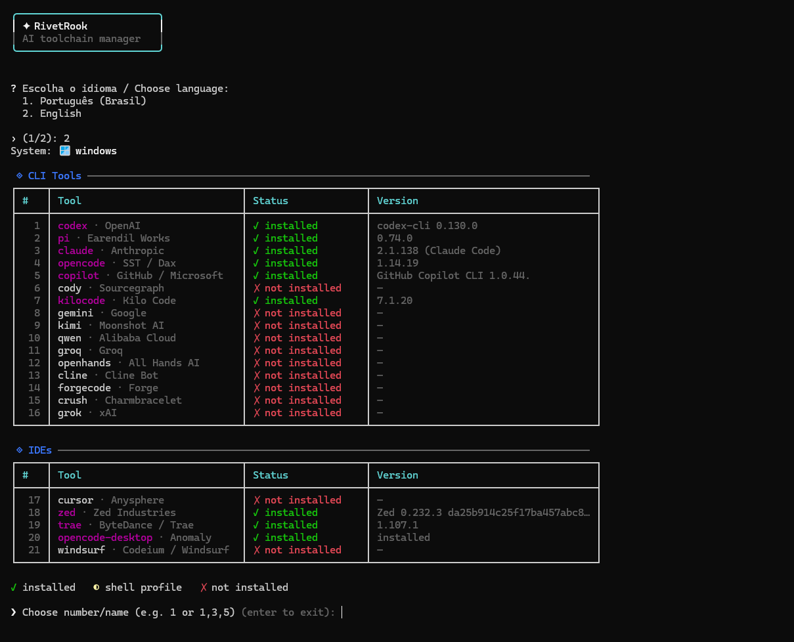

# RivetRook

<p align="center">
  
  
  
  
</p>

<p align="center">
   <a href="#português">Português</a> &nbsp;·&nbsp;  <a href="#english">English</a>
</p>

<p align="center">
  
</p>

<p align="center">
  Exemplo da interface interativa do RivetRook · Example of the RivetRook interactive interface
</p>

---

##  Português <a id="português"></a>

> **Gerenciador de ferramentas de IA via CLI** — Instala, atualiza e gerencia Claude, Codex, Gemini, OpenCode, Cline e IDEs com IA integrada.

### Funcionalidades

- ✅ Instalação automática de dependências (Node.js)
- ✅ Multi-plataforma — Windows, Linux, macOS
- ✅ Instalação, atualização e desinstalação com menu interativo
- ✅ Gestão de API Keys integrada
- ✅ Detecção paralela de versões com barra de progresso
- ✅ Bilíngue — Português / English
- ✅ Extensível via `config.json` — adicione suas próprias ferramentas

### Requisitos

| Requisito | Versão |
|-----------|--------|
| **Python** | 3.8+ |
| **Node.js** | 20+ (instalado automaticamente) |
| **npm** | qualquer |

> O Node.js é instalado automaticamente se não estiver presente.

### Instalação

**Windows**

```powershell
git clone https://github.com/paulocarinhena/RivetRook.git
cd RivetRook\src
python RivetRook.py
```

> Dica: use o atalho incluso:
> ```powershell
> .\Execute_RivetRook.bat
> ```

**Linux / macOS**

```bash
git clone https://github.com/paulocarinhena/RivetRook.git
cd RivetRook/src
python3 RivetRook.py
```

### Como Usar

Ao iniciar, o programa:

1. Pergunta o idioma (Português / English)
2. Verifica o Node.js — instala se necessário
3. Varre todas as ferramentas em paralelo e exibe o estado
4. Apresenta o menu interativo

**Navegação**

| Entrada | Ação |
|---------|------|
| `1` | Selecionar ferramenta pelo número |
| `claude` | Selecionar pelo nome |
| `1,3,5` | Selecionar múltiplas ferramentas |
| `enter` (vazio) | Sair |

**Ações disponíveis por ferramenta**

| Opção | Ação |
|-------|------|
| `1` | Instalar |
| `2` | Atualizar |
| `3` | Desinstalar |
| `4` | Configurar API key (quando disponível) |

### Ferramentas Suportadas

**CLI Tools**

| Ferramenta | Autor | Descrição |
|-----------|-------|-----------|
| **codex** | OpenAI | Agente de codificação autônomo no terminal |
| **pi** | Earendil Works | Agente de codificação terminal com SDK e extensões |
| **claude** | Anthropic | CLI oficial do Claude Code |
| **opencode** | SST / Dax | Assistente open source multi-modelo |
| **copilot** | GitHub / Microsoft | Assistente com integração nativa ao GitHub |
| **cody** | Sourcegraph | CLI para chat e automação de código |
| **kilocode** | Kilo Code | Fork open source do Cline |
| **gemini** | Google | CLI com acesso ao Gemini e Google Search |
| **kimi** | Moonshot AI | CLI com suporte a ACP/MCP |
| **qwen** | Alibaba | Assistente de codificação da Alibaba |
| **groq** | Groq | CLI com inferência ultra-rápida via LPU |
| **openhands** | All Hands AI | Agente autônomo de desenvolvimento |
| **cline** | Cline | Agente autônomo no VS Code terminal |
| **forgecode** | Forge | CLI conversacional para repositórios |
| **crush** | Charmbracelet | Agente TUI elegante |
| **grok** | xAI | CLI do Grok |

**IDEs**

| IDE | Autor | Descrição |
|-----|-------|-----------|
| **cursor** | Anysphere | Editor com IA baseado no VS Code |
| **zed** | Zed Industries | Editor de alta performance com IA |
| **trae** | ByteDance | IDE com agentes IA |
| **opencode-desktop** | SST / Dax | OpenCode em interface gráfica |
| **windsurf** | Codeium | IDE agentic |

### Gerenciadores por Plataforma

| Plataforma | Gerenciadores usados |
|------------|----------------------|
| Windows | `winget`, `PowerShell` |
| macOS | `brew`, `npm`, `curl` |
| Linux (Debian/Ubuntu) | `apt`, `npm`, `curl` |
| Linux (Fedora/RHEL) | `dnf`, `npm`, `curl` |
| Linux (Arch) | `pacman`, `npm`, `curl` |

### API Keys

Algumas ferramentas requerem uma API key para funcionar. O RivetRook:

- **Detecta automaticamente** se a chave já está configurada
- **Solicita a chave** logo após uma instalação bem-sucedida
- **Salva no arquivo de configuração** da ferramenta (ex.: `~/.claude.json`)
- **Persiste como variável de ambiente** nos arquivos de shell (`.bashrc`, `.zshrc`, `.profile`) no Linux/macOS

Para configurar a chave de uma ferramenta já instalada, selecione-a no menu e escolha a opção **4 – Configurar API key**.

### Como Adicionar Ferramentas

O RivetRook é totalmente extensível. Edite `src/config.json` para adicionar novas ferramentas na seção `"tools"` ou `"ides"`:

```jsonc
"minha-ferramenta": {
  "author": "Empresa",
  "description": "Descrição em português",
  "description_en": "Description in English",
  "needs_git": 0,
  "install": {
    "all": "npm install -g minha-ferramenta",
    "windows": "winget install -e --id Empresa.Ferramenta",
    "macos": "brew install minha-ferramenta",
    "linux": {
      "debian": "apt-get install -y minha-ferramenta",
      "fedora": "dnf install -y minha-ferramenta",
      "default": "npm install -g minha-ferramenta"
    }
  },
  "upgrade": { "all": "npm install -g minha-ferramenta@latest" },
  "uninstall": { "all": "npm uninstall -g minha-ferramenta" },
  "run": "minha-ferramenta",
  "version_cmd": { "all": "minha-ferramenta --version" }
}
```

| Campo | Tipo | Descrição |
|-------|------|-----------|
| `author` | string | Nome do autor/empresa |
| `description` | string | Descrição em português |
| `description_en` | string | Descrição em inglês |
| `needs_git` | 0/1 | Requer Git no Windows |
| `install` | object | Comandos por plataforma (`all`, `windows`, `macos`, `linux`) |
| `upgrade` | object | Comandos de atualização |
| `uninstall` | object | Comandos de desinstalação (inferido automaticamente se ausente) |
| `run` | string | Binário principal (detecção de versão e estado) |
| `version_cmd` | string/object | Comando alternativo para obter a versão |
| `version_regex` | string | Regex para extrair a versão (grupo de captura 1) |
| `skip_version_probe` | bool | Não executa o binário para detectar versão (IDEs gráficas) |
| `path_entry` | object | Diretório a adicionar ao PATH após instalar |
| `configure` | object | Configuração de API key (`env_var`, `settings_file`, `settings_key`, `prompt`) |

### Contribuindo

Contribuições são bem-vindas! Veja [CONTRIBUTING.md](./CONTRIBUTING.md) para:

- Como reportar bugs ou solicitar novas ferramentas
- Como propor uma nova ferramenta via Pull Request
- Diretrizes de código

### Aviso Legal

> **RivetRook é apenas um facilitador de instalação.**
>
> Esta ferramenta não modifica, redistribui nem se apropria de nenhum software de terceiros. Ela apenas automatiza a execução dos comandos de instalação oficiais fornecidos pelos próprios fabricantes (via `npm`, `winget`, `brew`, `apt`, etc.), exatamente como você faria manualmente no terminal.
>
> Todas as ferramentas listadas são propriedade exclusiva de suas respectivas empresas desenvolvedoras. RivetRook não possui nenhuma afiliação com essas empresas.
>
> O objetivo do projeto é tornar acessível a qualquer pessoa — independente do nível técnico — a instalação de ferramentas oficiais de IA de forma simples, segura e rastreável.

### Licença

[GPL-3.0](./LICENSE)

---

##  English <a id="english"></a>

> **AI toolchain manager** — Install, update and manage AI coding tools like Claude, Codex, Gemini, OpenCode, Cline and AI-powered IDEs from a single interactive CLI.

### Features

- ✅ Automatic dependency installation (Node.js)
- ✅ Cross-platform — Windows, Linux, macOS
- ✅ Install, update and uninstall via interactive menu
- ✅ Built-in API Key management
- ✅ Parallel version detection with progress bar
- ✅ Bilingual — Português / English
- ✅ Extensible via `config.json` — add your own tools

### Requirements

| Requirement | Version |
|-------------|---------|
| **Python** | 3.8+ |
| **Node.js** | 20+ (installed automatically) |
| **npm** | any |

> Node.js is installed automatically if not present.

### Installation

**Windows**

```powershell
git clone https://github.com/paulocarinhena/RivetRook.git
cd RivetRook\src
python RivetRook.py
```

> Tip: use the included shortcut:
> ```powershell
> .\Execute_RivetRook.bat
> ```

**Linux / macOS**

```bash
git clone https://github.com/paulocarinhena/RivetRook.git
cd RivetRook/src
python3 RivetRook.py
```

### Usage

On startup, the program:

1. Asks for the language (Português / English)
2. Checks for Node.js — installs it if missing
3. Scans all tools in parallel and displays their state
4. Shows the interactive menu

**Navigation**

| Input | Action |
|-------|--------|
| `1` | Select tool by number |
| `claude` | Select by name |
| `1,3,5` | Select multiple tools |
| `enter` (empty) | Exit |

**Available actions per tool**

| Option | Action |
|--------|--------|
| `1` | Install |
| `2` | Update |
| `3` | Uninstall |
| `4` | Configure API key (when available) |

### Supported Tools

**CLI Tools**

| Tool | Author | Description |
|------|--------|-------------|
| **codex** | OpenAI | Autonomous coding agent in the terminal |
| **pi** | Earendil Works | Terminal coding agent with SDK and extensions |
| **claude** | Anthropic | Official Claude Code CLI |
| **opencode** | SST / Dax | Open-source multi-model coding assistant |
| **copilot** | GitHub / Microsoft | Assistant with native GitHub integration |
| **cody** | Sourcegraph | CLI for chat and code automation |
| **kilocode** | Kilo Code | Open-source fork of Cline |
| **gemini** | Google | CLI with Gemini and Google Search access |
| **kimi** | Moonshot AI | CLI with ACP/MCP support |
| **qwen** | Alibaba | Alibaba coding assistant CLI |
| **groq** | Groq | CLI with ultra-fast LPU inference |
| **openhands** | All Hands AI | Autonomous development agent |
| **cline** | Cline | Autonomous agent in the VS Code terminal |
| **forgecode** | Forge | Conversational CLI for repositories |
| **crush** | Charmbracelet | Elegant TUI agent |
| **grok** | xAI | Grok CLI |

**IDEs**

| IDE | Author | Description |
|-----|--------|-------------|
| **cursor** | Anysphere | AI-powered editor based on VS Code |
| **zed** | Zed Industries | High-performance editor with AI |
| **trae** | ByteDance | IDE with AI agents |
| **opencode-desktop** | SST / Dax | OpenCode in a graphical interface |
| **windsurf** | Codeium | Agentic IDE |

### Package Managers by Platform

| Platform | Package managers used |
|----------|-----------------------|
| Windows | `winget`, `PowerShell` |
| macOS | `brew`, `npm`, `curl` |
| Linux (Debian/Ubuntu) | `apt`, `npm`, `curl` |
| Linux (Fedora/RHEL) | `dnf`, `npm`, `curl` |
| Linux (Arch) | `pacman`, `npm`, `curl` |

### API Keys

Some tools require an API key to function. RivetRook:

- **Automatically detects** if a key is already configured
- **Prompts for the key** right after a successful installation
- **Saves it to the tool's config file** (e.g. `~/.claude.json`)
- **Persists it as an environment variable** in shell RC files (`.bashrc`, `.zshrc`, `.profile`) on Linux/macOS

To configure a key for an already-installed tool, select it in the menu and choose option **4 – Configure API key**.

### Adding New Tools

RivetRook is fully extensible. Edit `src/config.json` to add new tools under `"tools"` or `"ides"`:

```jsonc
"my-tool": {
  "author": "Company",
  "description": "Descrição em português",
  "description_en": "Description in English",
  "needs_git": 0,
  "install": {
    "all": "npm install -g my-tool",
    "windows": "winget install -e --id Company.Tool",
    "macos": "brew install my-tool",
    "linux": {
      "debian": "apt-get install -y my-tool",
      "fedora": "dnf install -y my-tool",
      "default": "npm install -g my-tool"
    }
  },
  "upgrade": { "all": "npm install -g my-tool@latest" },
  "uninstall": { "all": "npm uninstall -g my-tool" },
  "run": "my-tool",
  "version_cmd": { "all": "my-tool --version" }
}
```

| Field | Type | Description |
|-------|------|-------------|
| `author` | string | Author / company name |
| `description` | string | Description in Portuguese |
| `description_en` | string | Description in English |
| `needs_git` | 0/1 | Requires Git on Windows |
| `install` | object | Commands per platform (`all`, `windows`, `macos`, `linux`) |
| `upgrade` | object | Update commands |
| `uninstall` | object | Uninstall commands (auto-inferred if omitted) |
| `run` | string | Main binary (used for version detection and state) |
| `version_cmd` | string/object | Alternative command to get the version |
| `version_regex` | string | Regex to extract the version (capture group 1) |
| `skip_version_probe` | bool | Skip running the binary to detect version (GUI IDEs) |
| `path_entry` | object | Directory to add to PATH after install |
| `configure` | object | API key config (`env_var`, `settings_file`, `settings_key`, `prompt`) |

### Contributing

Contributions are welcome! See [CONTRIBUTING.md](./CONTRIBUTING.md) for:

- How to report bugs or request new tools
- How to propose a new tool via Pull Request
- Code guidelines

### Disclaimer

> **RivetRook is an installation facilitator only.**
>
> This tool does not modify, redistribute, or claim ownership of any third-party software. It simply automates the official installation commands provided by each tool's own vendor (via `npm`, `winget`, `brew`, `apt`, etc.) — exactly as you would run them manually in a terminal.
>
> All listed tools are the exclusive property of their respective developers and companies. RivetRook has no affiliation with any of them.
>
> The goal of this project is to make it easy for anyone — regardless of technical background — to install official AI tools in a simple, safe and transparent way.

### License

[GPL-3.0](./LICENSE)

---

<div align="center">

Made with ❤️ for the AI developer community.  
Created by **Paulo Carinhena** — https://github.com/paulocarinhena

</div>
